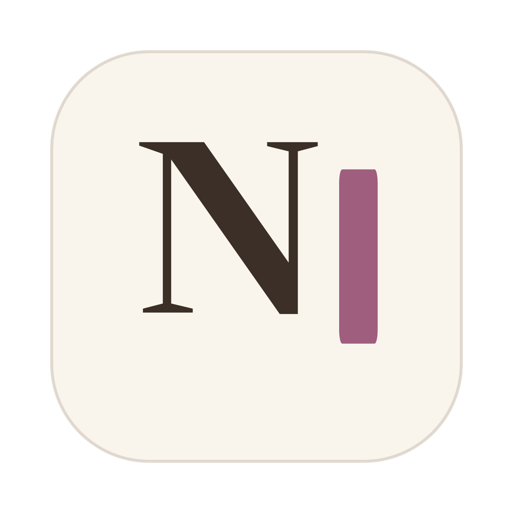
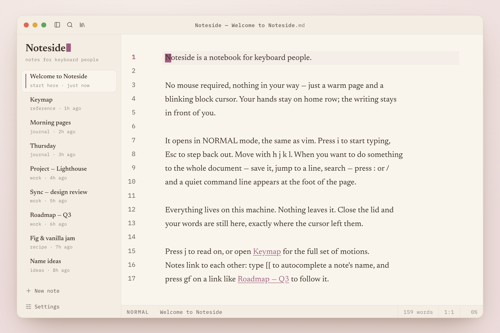

<p align="center">
  
</p>

<h1 align="center">Noteside</h1>

<p align="center">
  <strong>Notes for keyboard people.</strong><br/>
  An offline, local-first notebook you drive entirely from the keyboard — full vim, or
  the conventional shortcuts you already know. Your notes stay as plain Markdown files
  on your disk.
</p>

<p align="center">
  <a href="#license"></a>
  
  
  
  
</p>

<p align="center">
  <picture>
    <source media="(prefers-color-scheme: dark)" srcset="assets/screenshot-dark.png" />
    
  </picture>
</p>

---

Noteside is a desktop notebook for people who'd rather keep their hands on home
row — full vim if you want it, conventional `⌘`-shortcuts if you don't. The page is
the interface, and every note is a plain `.md` file in a folder you choose — grep it,
back it up, sync it, or walk away with it. Nothing leaves your machine.

It's built on **CodeMirror 6 + a real vim engine** inside a native **Tauri**
window, with a Rust core that treats your files as the source of truth.

> **Install:** download a build for macOS, Windows, or Linux from
> [Releases](https://github.com/joshxfi/noteside/releases/latest), or build from
> source (below). Builds aren't code-signed yet — macOS flags them as _"damaged"_
> on first launch (Gatekeeper blocking an unsigned download, not real damage).
> [Getting started](https://docs.noteside.app/getting-started) has the one-line
> fix. Signing is on the roadmap.

## Highlights

- **First-class vim.** Real modes, motions, operators, registers, macros, counts,
  `/` search with match highlighting, marks, and a jumplist — via CodeMirror 6 and
  [`@replit/codemirror-vim`](https://github.com/replit/codemirror-vim). Ex-commands
  are wired to the app, and a `<Space>` leader opens a which-key command palette.
- **Keyboard-first, vim optional.** Don't use vim? Turn it off and drive everything with
  conventional shortcuts — `⌘P` to find, `⌘⇧P` for a searchable command palette, `⌘F` to
  find in the note, `⌘/` for the full cheatsheet — all remappable via `bind` lines in
  `~/.notesiderc`. The chords are always on, so they work alongside vim too.
- **Files as truth.** Notes are plain Markdown in a folder you pick. The Rust core
  scans them into a rebuildable in-memory index, writes **atomically** (temp →
  fsync → rename), and watches the folder so external edits (other editors, git,
  sync) reload live.
- **Offline & local-first.** No account, no telemetry, no network. Close the lid and
  your words are exactly where the cursor left them.
- **Inline live-preview.** Markdown renders in place, Obsidian-style — the `#`, `**`,
  `` ` ``, and `[[ ]]` markup hides on every line _except_ the one you're editing,
  so the document is never rewritten and vim motions stay on the literal text.
  Toggle with `:preview` or `<Space> p`.
- **Wikilinks & backlinks.** Type `[[` to autocomplete a note by title; press `gf`
  to follow the link under the cursor; open the **Linked references** panel
  (`<Space> l`) to see everything that points at the current note.
- **Instant search.** Fuzzy file/title finding (Rust [`nucleo`](https://github.com/helix-editor/nucleo))
  plus line-level content search (plain · regex · fuzzy) with a live preview pane.
- **Warm, literary design, 33 themes.** A serif reading surface and one quiet plum
  cursor by default — plus a curated set of base16 palettes (Catppuccin, Gruvbox,
  Nord, Rosé Pine, Tokyo Night, …) behind a live-preview picker (`:theme` /
  `<Space> t`). Everything is configurable from a live `~/.notesiderc` buffer
  (vimrc-flavored) or an in-app settings panel.

## Keys

Standard vim throughout. On top of that:

| Key / command              | Does                                          |
| -------------------------- | --------------------------------------------- |
| `<Space>`                  | Open the command palette (which-key)          |
| `:w` `:q` `:wq`            | Save · close note · save & close              |
| `:find` `:grep`            | Fuzzy file finder · content search            |
| `gf` / `:follow`           | Follow the `[[wikilink]]` under the cursor    |
| `:backlinks` / `<Space> l` | Linked-references panel for the current note  |
| `:new` `:rm`               | New note · delete note                        |
| `:preview` / `<Space> p`   | Toggle inline live-preview                    |
| `:theme` / `<Space> t`     | Theme picker (33 themes, live preview)        |
| `⌘=` `⌘-` `⌘0`             | Editor font size (`⇧` for interface size)     |
| `:settings` `:config`      | Settings panel · edit `~/.notesiderc`         |
| `:set …`                   | CodeMirror-vim options (e.g. `:set hlsearch`) |

Insert-escape (e.g. `jj`) and your own `nmap`/`imap`/`vmap` mappings live in
`~/.notesiderc` and apply on `:w`.

**Don't use vim?** Turn it off (`set vim = off`, or the settings panel) and the same
commands are conventional chords — always available, even with vim on:

| Chord        | Does                              |
| ------------ | --------------------------------- |
| `⌘P`         | Find files & content              |
| `⌘⇧P`        | Searchable command palette        |
| `⌘⇧F`        | Content search (grep)             |
| `⌘F`         | Find in the current note (toggle) |
| `F3` / `⇧F3` | Next / previous search match      |
| `⌘N`         | New note                          |
| `⌘S`         | Save note                         |
| `⌘W`         | Close note                        |
| `⌘⇧T`        | Reopen closed note                |
| `⌘J` / `⌘K`  | Next / previous note              |
| `⌥↵`         | Follow link under cursor          |
| `⌘B`         | Toggle the sidebar                |
| `⌘E`         | Toggle inline live-preview        |
| `⌘⇧L`        | Linked-references panel           |
| `⌘,`         | Settings panel                    |
| `⌘/`         | Keyboard cheatsheet               |

`⌘` is Cmd on macOS, Ctrl elsewhere. Every chord is customizable: `⌘/` opens the
cheatsheet, which doubles as a **live keymap editor** (`j`/`k` to navigate, Enter to
rebind, Del to unbind, `r` to reset) — or write `bind <chord> <command>` lines in
`~/.notesiderc`. Either way, changes persist to that file.

## Documentation

Full docs live at **[docs.noteside.app](https://docs.noteside.app)** — getting started,
keybindings, search, wikilinks, live preview, and configuration. Run them locally with
`pnpm dev:docs`.

## Tech stack

- **App:** [Tauri 2](https://v2.tauri.app) · React 19 · Vite · TypeScript
- **Editor:** CodeMirror 6 · `@replit/codemirror-vim`
- **Core (Rust):** files-as-truth storage, atomic writes, `notify` file watcher,
  `nucleo` fuzzy matching, line-level content search
- **Tooling:** Turborepo · pnpm · [oxlint + oxfmt](https://oxc.rs) · Vitest + `cargo test`

## Project structure

```
apps/
  desktop/   Tauri 2 + React 19 + TypeScript — the app (Rust core in src-tauri/)
  landing/   Vite + React + Tailwind v4 — the marketing site (embeds the real app)
  docs/      Fumadocs on React Router 7 — the documentation site (docs.noteside.app)
  brand/     The brand guide — internal reference only, not deployed
```

## Getting started

**Prerequisites**

- **Node 24** and **pnpm 11** — `corepack enable` (the repo pins both)
- **Rust** (stable) + the [Tauri 2 system dependencies](https://v2.tauri.app/start/prerequisites/)
  to run or build the desktop app

**Develop**

```bash
pnpm install

pnpm dev            # landing (:3000) + desktop Tauri window
pnpm dev:desktop    # just the desktop app (native window + Vite HMR)
pnpm dev:landing    # just the landing site
pnpm dev:docs       # just the docs site (:3002)
pnpm dev:brand      # the brand guide (:3001)

pnpm typecheck      # tsc across the workspace
pnpm test           # Vitest (frontend)   ·   pnpm test:rust  (cargo test)
pnpm bench          # vitest benchmarks   ·   `cargo bench` in src-tauri for Rust
pnpm lint           # oxlint              ·   pnpm format (oxfmt)
pnpm build          # web bundles for all apps
```

No Rust toolchain? `pnpm --filter @noteside/desktop dev:web` runs the UI in a plain
browser against an in-memory mock backend — handy for frontend work.

**Build the native app**

```bash
# the icon art is scripts/mark.html (the brand mark in Newsreader); render it to
# src-tauri/app-icon.png (see that file's header), then regenerate the icon set:
pnpm --filter @noteside/desktop tauri icon src-tauri/app-icon.png
pnpm tauri build                                                   # native installers
```

## How it works

- **Files-as-truth core** (`apps/desktop/src-tauri/src/`). `open_notebook` scans the
  folder into an in-memory index; `save_note` writes atomically; a debounced
  `notify` watcher emits `notebook:changed` (with a self-write suppression window)
  so external edits reload without clobbering yours.
- **The vim engine is the editor.** `editor/` wires CodeMirror 6 + the vim plugin to
  the app: ex-commands and the leader palette dispatch through a small handler
  registry; live-preview and wikilink decorations hide markup only off the cursor
  line, so the buffer text the editor saves is always the literal Markdown.
- **Wikilinks are pure + indexed.** Resolution lives in a CodeMirror-free module
  (`links.ts`), mirrored in Rust (`links.rs`) so the backlinks scan runs off the
  main thread and only references cross the IPC boundary.
- **A swap-in backend seam** (`src/backend/`). A `Backend` interface has a Tauri
  adapter (real IPC) and an in-memory mock, so the browser dev mode and the landing
  demo run the exact same UI without a Rust process.

## Performance

The hot paths are benchmarked (`cargo bench`, `pnpm bench`). On a modern laptop:

- **Native shell.** A Rust core (Tauri) over the OS webview — instant launch, low
  memory, a small native binary, and no background daemon.
- Fuzzy file search stays **sub-millisecond even at 50k notes** (`nucleo`).
- Content search is a fast in-memory scan — ~2 ms at 1k notes, ~20 ms at 10k, and
  ~100 ms even at 50k, with no database or index to build, write, or keep in sync.
- The note sidebar **virtualizes** past 100 notes (only visible rows mount).
- Backlinks are computed in Rust, not by shipping every note body to the UI.

## Contributing

Contributions are welcome. Before opening a PR, run the gates:

```bash
pnpm typecheck && pnpm lint && pnpm format:check && pnpm test && pnpm test:rust
```

Commits follow [Conventional Commits](https://www.conventionalcommits.org) — the type drives the automated version bump and changelog (`feat:` → minor, `fix:` → patch). See **[CONTRIBUTING.md](CONTRIBUTING.md)** for the conventions in full.

## License

[MIT](LICENSE) © Noteside — built by [Josh Daniel](https://github.com/joshxfi)
