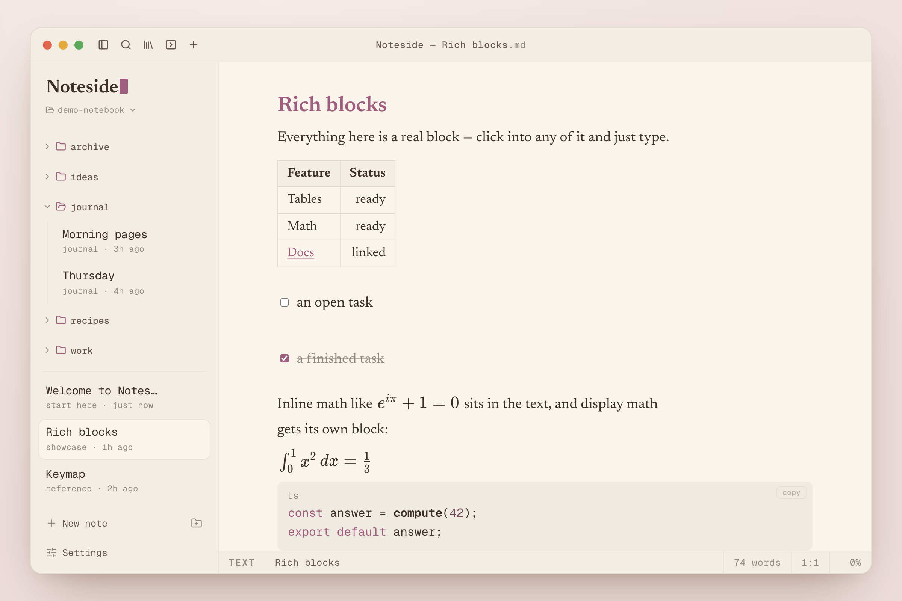

<p align="center">
  
</p>

<h1 align="center">Noteside</h1>

<p align="center">
  A fast, minimalist offline notebook with a Notion-like block editor. Point and click, or drive everything from the keyboard — vim modes and motions, or the conventional shortcuts you already know. Your notes stay as plain Markdown files on your disk.
</p>

<p align="center">
  <a href="https://github.com/joshxfi/noteside/releases"></a>
  <a href="#license"></a>
  
  
  
</p>

<p align="center">
  <picture>
    <source media="(prefers-color-scheme: dark)" srcset="assets/screenshot-dark.png" />
    
  </picture>
</p>

---

## Install

Download for **macOS, Windows, or Linux** from **[noteside.app](https://noteside.app)** —
or grab a build directly from
[GitHub Releases](https://github.com/joshxfi/noteside/releases/latest).

Builds aren't code-signed yet, so the OS shows a one-time warning on first launch —
the app isn't broken, your system just can't verify an unsigned download:

- **macOS** reports the app as _"damaged."_ Drag **Noteside** into `/Applications`,
  then clear the quarantine flag once:
  ```bash
  xattr -dr com.apple.quarantine /Applications/Noteside.app
  ```
- **Windows** — click **More info → Run anyway** on the SmartScreen prompt.

Full walkthrough: **[Getting started](https://docs.noteside.app/getting-started)**.

## Documentation

Everything lives at **[docs.noteside.app](https://docs.noteside.app)**:

- [Getting started](https://docs.noteside.app/getting-started) — install, open a notebook, your first note
- [Editor](https://docs.noteside.app/editor) — tables, code blocks, callouts, math, and images edited in place as real blocks; the file on disk stays plain Markdown
- [Folders](https://docs.noteside.app/folders) — organize notes into real subdirectories: collapsible sidebar groups, the move picker, and drag-and-drop
- [Keybindings](https://docs.noteside.app/keybindings) — a vim subset + conventional chords, and remapping them
- [Search](https://docs.noteside.app/search) — fuzzy file finder and line-level content grep
- [Configuration](https://docs.noteside.app/configuration) — `~/.notesiderc`, themes, and settings
- [Performance](https://docs.noteside.app/performance) — how it stays fast at scale

## Contributing

Issues and PRs are welcome. See **[CONTRIBUTING.md](CONTRIBUTING.md)** for prerequisites,
the dev/build commands, the project layout, and the conventions.

## License

[MIT](LICENSE) © Noteside — built by Josh Daniel
